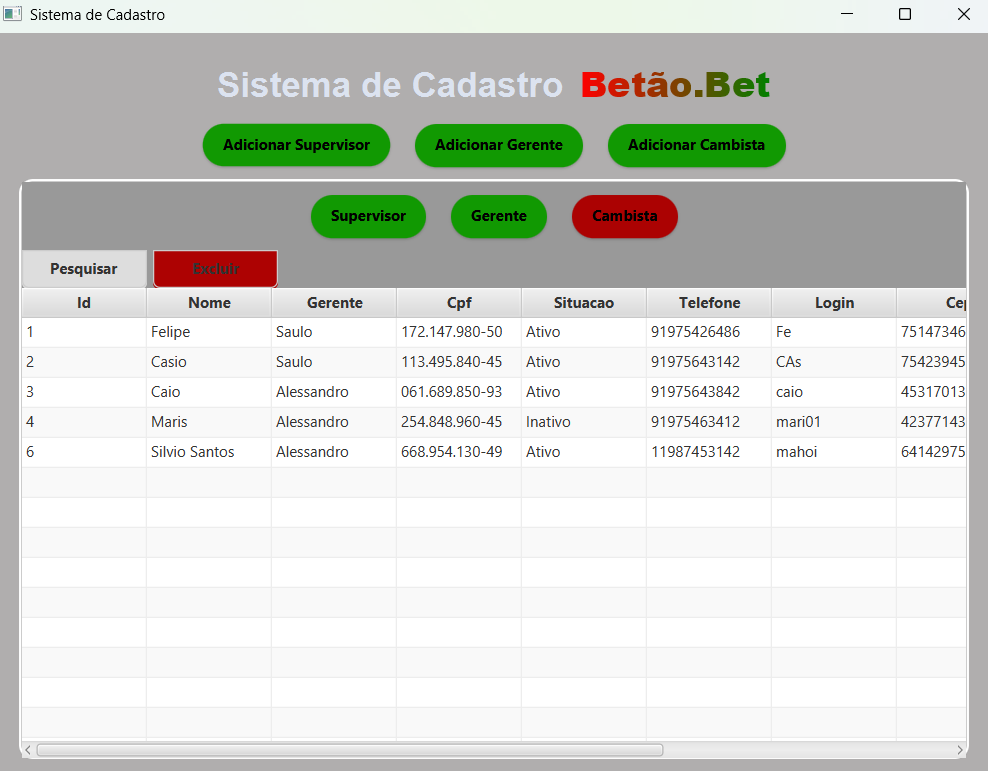
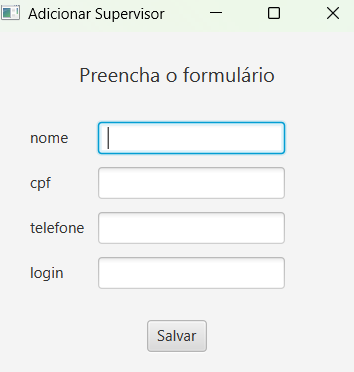
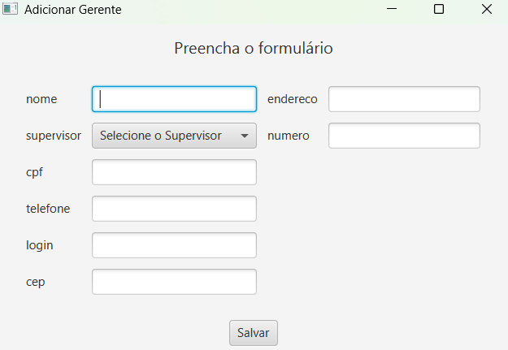
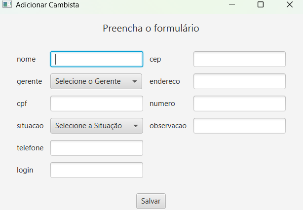
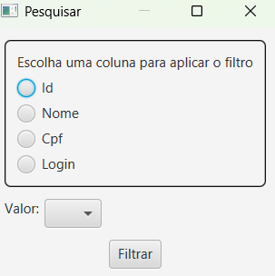
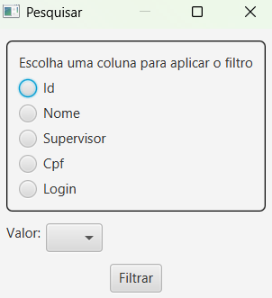
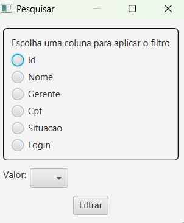

# 📌 Sistema de Cadastro Betão.Bet

Sistema JavaFX com persistência via Hibernate no banco de dados mySql com foco no back-end para cadastro hierárquico de perfis de uma casa de apostas.

## 🚀 Funcionalidades

- ✔️ Cadastro hierárquico: Supervisor → Gerente → Cambista
- ✔️ CRUD completo com persistência em banco de dados
- ✔️ Edição inline com validação em tempo real
- ✔️ Filtros avançados com seleção dinâmica de campos
- ✔️ Campos obrigatórios destacados em vermelho quando não preenchidos
- ✔️ Limpeza automática dos campos após cadastro bem-sucedido
- ✔️ Fechamento automático do EntityManager ao sair da aplicação

## 🛠️ Tecnologias & Arquitetura

### Backend

- Java 17+
- Hibernate / JPA
- Padrão DAO genérico com Singleton
- Conversores customizados para enums
- Gerenciamento automático de transações

### Frontend

- JavaFX (TableView editável, ComboBox dinâmico)
- CSS customizado para estilização
- Janelas modais para formulários

### Banco de Dados

- MySQL

## 🖥️ Estrutura do Projeto

```bash
src/
├── main/
│   ├── java/org/example/projetoBet/
│   │   ├── Infra/                  # Camada de infraestrutura
│   │   │   ├── DAO.java            # Classe DAO genérica
│   │   │   ├── Situacao.java       # Enum de situação
│   │   │   ├── ConverterSituacao.java       # Conversor Enum
│   │   ├── layout/                 # Telas JavaFX
│   │   │   ├── LayoutPrincipal.java  # Tela principal
│   │   │   ├── TelaAddFactory.java   # Criação dinâmica de formulários
│   │   │   ├── TelaPesquisar.java    # Tela de filtro avançado
│   │   ├── modelo/                 # Entidades JPA
│   │   │   ├── Supervisor.java 
│   │   │   ├── Gerente.java
│   │   │   ├── Cambista.java
│   ├── resources/
│   │   ├── styles
│   │   │   ├── styles.css         # Estilização da interface
│   │   ├── META-INF
│   │   │   ├── persistence.xml    # Configuração do JPA
```

## 🏁 Como Executar

Pré-requisitos:
- JDK 17+
- Maven
- MySQL rodando localmente

Clone e execute:

```bash
git clone https://github.com/seu-usuario/projetoBet.git
cd projetoBet
mvn clean javafx:run
```

## 💻 Interface do Sistema

### 🖥️ Tela Principal

<p align="center">
  
</p>

---

### 🧾 Telas de Cadastro

<table>
  <thead>
    <tr>
      <th>Supervisor</th>
      <th>Gerente</th>
      <th>Cambista</th>
    </tr>
  </thead>
  <tbody>
    <tr>
      <td align="center"></td>
      <td align="center"></td>
      <td align="center"></td>
    </tr>
  </tbody>
</table>

---

### 🔍 Telas de Filtro

<table>
  <thead>
    <tr>
      <th>Supervisor</th>
      <th>Gerente</th>
      <th>Cambista</th>
    </tr>
  </thead>
  <tbody>
    <tr>
      <td align="center"></td>
      <td align="center"></td>
      <td align="center"></td>
    </tr>
  </tbody>
</table>

### ✏️ Edição de Registros

<p align="center">
  
</p>

---

### ❌ Exclusão de Registros

<p align="center">
  
</p>

## 🤝 Padrões de Projeto Utilizados

- Singleton (DAO)
- Factory Method (TelaAddFactory)
- Observer (JavaFX Listeners)
- Layer Supertype (DAO genérico)

## 📞 Contato

- ✉️ Email: emesonneves111@gmail.com
- 🔗 LinkedIn: linkedin.com/in/emeson-santos
